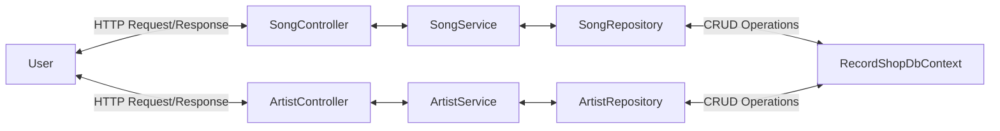

# 💿 Welcome to Visual Frequencies: Record Shop API 💿

A C# RESTful API using the MVC pattern. This API allows you to make HTTP requests to perform CRUD operations on an SQL Database of Artists and Songs.

## Project Diagram:

## API Endpoints Available: 

| Method Name                           |   Method Endpoint   | HTTP Method |                                                 Example Input                                                  |                                                                                                                 Returns                                                                                                                 |
|:--------------------------------------|:-------------------:|:-----------:|:--------------------------------------------------------------------------------------------------------------:|:---------------------------------------------------------------------------------------------------------------------------------------------------------------------------------------------------------------------------------------:|
| GetSongs()                            |     "api/song"      |     Get     | Takes optional parameters of song name, artist name and genre                                                - | If no parameters used, returns all songs in the database. If parameters are provided, database songs are filtered against these. Fuzzy Sharp library is used for 70% match for song names and 80% for artist name to accommodate typos. |
| AddSong(SongDTO songDTO)              |     "api/song"      |    Post     |     Post body: `{ "name" : "Hello", "artistId : 1, "description" : "meh",  "releaseDate" : "2025-03-02" }`     |                                                                                                             Returns Created                                                                                                             |
| GetRandomSong()                       |  "api/song/random"  |     Get     |                                                       -                                                        |                                                                                               Returns a song from the database by random                                                                                                |
| GetMatchingSongArtist(string search) | "api/song/homepage" |     Get     |                                          Parameter: `"bck to balck"`                                           |                                                          Returns songs from the database with either a 60% song name match or 90% artist name match  to the provided parameter                                                          |
| DeleteSong(int id)                    | "api/song?id={id}"  |    Delete   |                                                Parameter: `"1"`                                                |                                                                                     Deletes song matching Id from the database. Returns No Content                                                                                      | 
| GetArtists()                          |    "api/artist"     |     Get     |                                                       -                                                        |                                                                                                           Returns all artists                                                                                                           |
| AddArtist(Artist artist)              |    "api/artist"     |    Post     |                                 Post body: `{ "name" : "ACDC", "songs" : [] }`                                 |                                                                                                             Returns Created                                                                                                             |
| GetArtistById(int id)                 |  "api/artist/<id>"  |     Get     |                                             Param: "api/artist/2"                                              |                                                                                                Returns Artist from database matching Id                                                                                                 |
| PutArtist(UpdateArtist artist)        |    "api/artist"     |     Put     |                           Post body `{ "id" : "2", "name" : "Amy Jade Winehouse" }`                            |                                                                                         Updates Artist from database matching Id and returns OK                                                                                         |
| DeleteArtist(int id)                  |  "api/artist/<id>"  |   Delete    |                                             Param: "api/artist/2"                                              |                                                                                     Deletes Artist from database matching Id and returns NoContent                                                                                      |

## Set-up: 

- You will need an IDE for running C# .NET applications and SQL server installed 
- Fork the repo and clone it onto your local machine
- Run Program.cs
- Test endpoints using Swagger or Postman

## Further Development: 

- Rate limiting
- Caching

