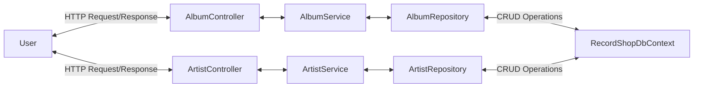

# 💿 Welcome to the Record Shop 💿

A C# RESTful API using the MVC pattern. This API allows you to make HTTP requests to perform CRUD operations on an SQL Database of Artists and Albums. 

## Project Diagram:

## API Endpoints Available: 

| Method Name                | Method Endpoint   | HTTP Method | Example Input |
| :------------------------  | :---------------: | :---------: | :----------:  |
| GetAlbums()                | "api/album"       |    Get      | - |
| AddAlbum(AlbumDTO albumDTO) | "api/album"       |   Post      | Post body: `{ "name" : "Hello", "artistId : 1, "description" : "meh",  "releaseDate" : "2025-03-02" }`
| GetArtists()  |  "api/artist"   | Get | - |
| AddArtist(Artist artist) |  "api/artist"   |  Post | Post body: `{ "name" : "ACDC", "albums" : [] }` |
| GetArtistById(int id) | "api/artist/<id>" | Get | Param: "api/artist/2" |
| PutArtist(UpdateArtist artist) | "api/artist" | Put | Post body `{ "id" : "2", "name" : "Amy Jade Winehouse" }` | 
| DeleteArtist(int id) | "api/artist/<id> | Delete|  Param: "api/artist/2" |

## Set-up: 

- You will need an IDE for running C# .NET applications and SQL server installed 
- Fork the repo and clone it onto your local machine
- Run Program.cs
- Test endpoints using Swagger or Postman

## Further Development: 

- Filtering parameters 
- Use of Many to Many relationships like Genre
- Rate limiting
- Caching
- Authorisation for DELETE methods  
- Front End 

